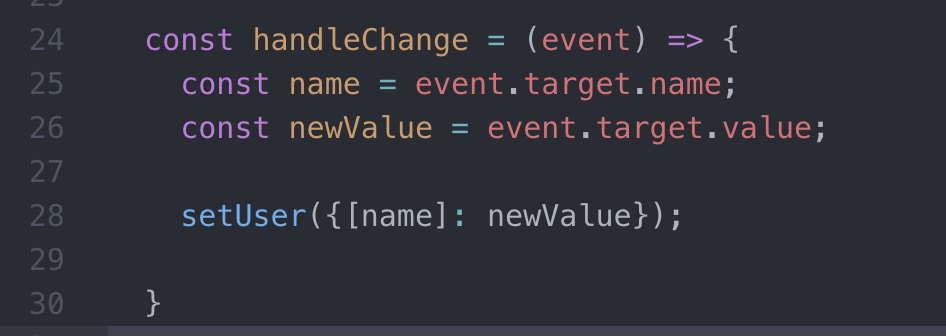
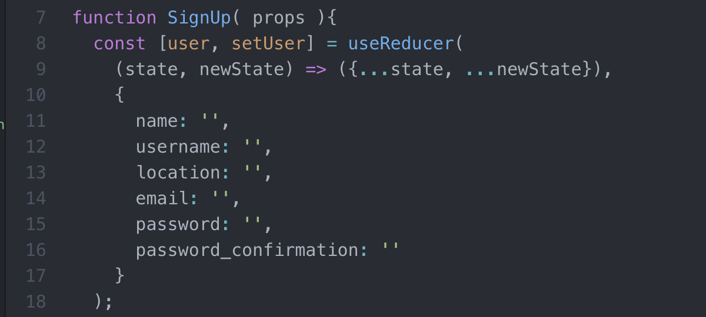
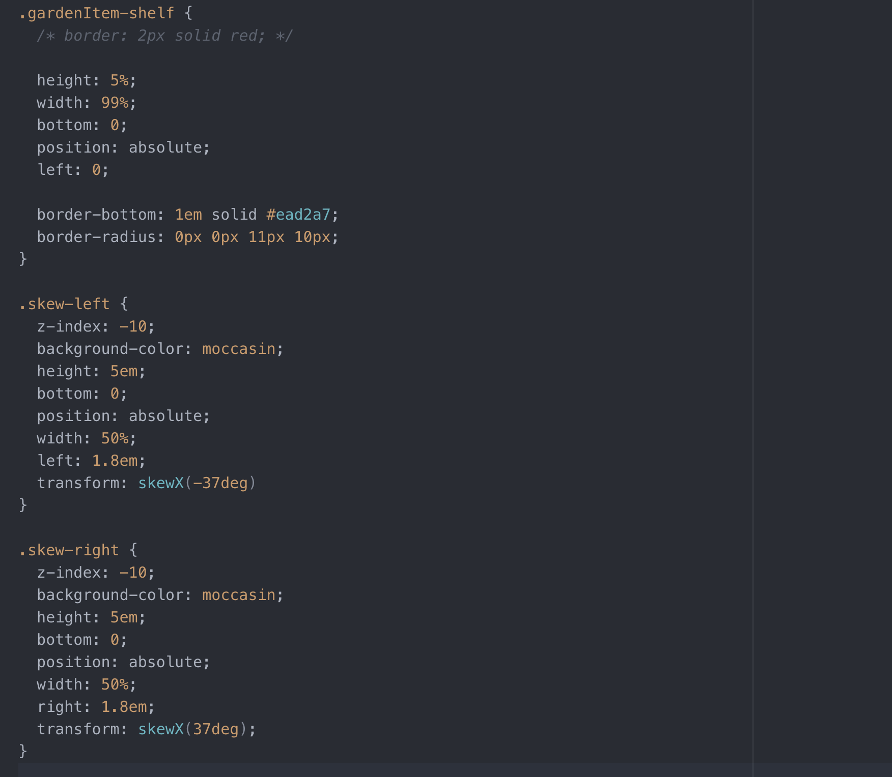
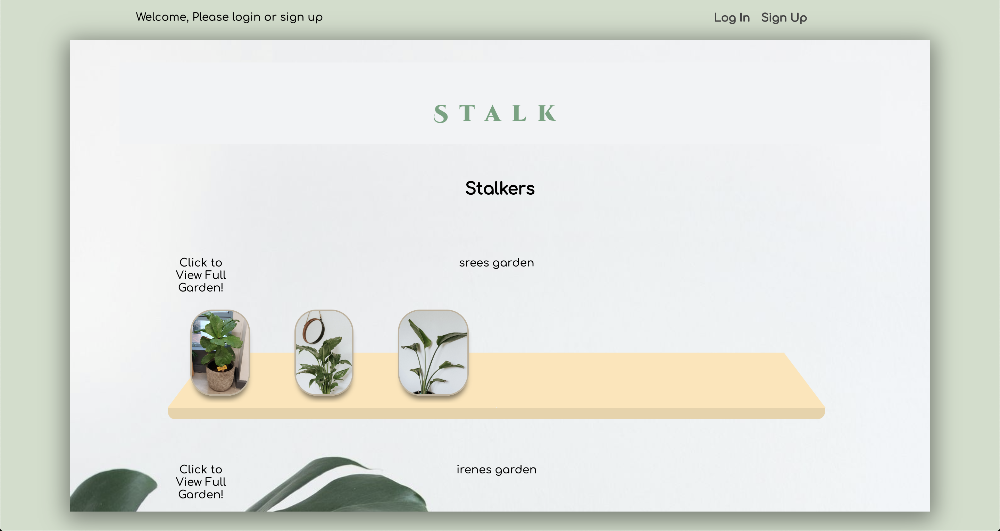
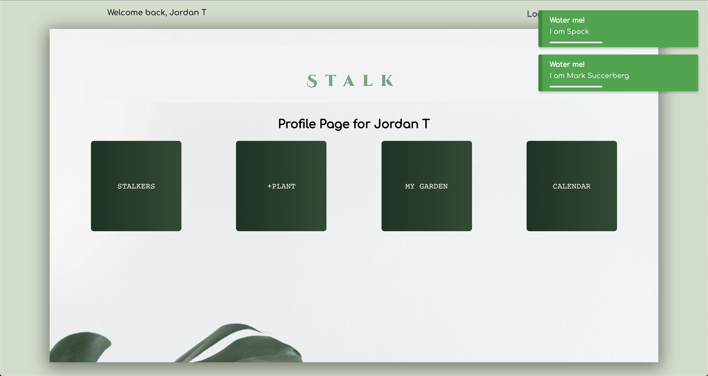
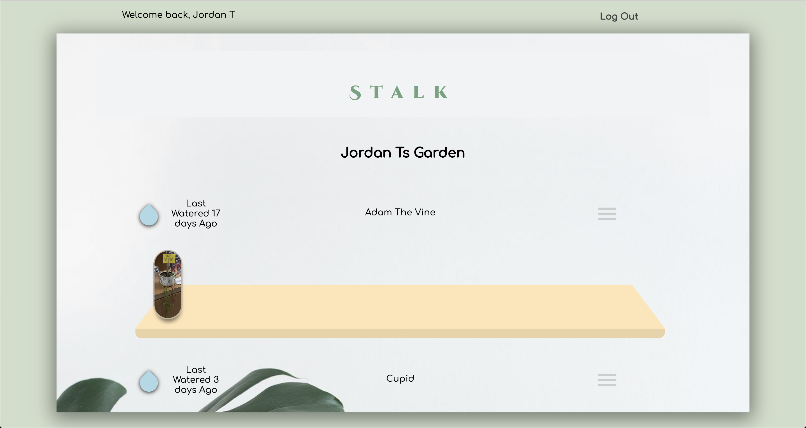
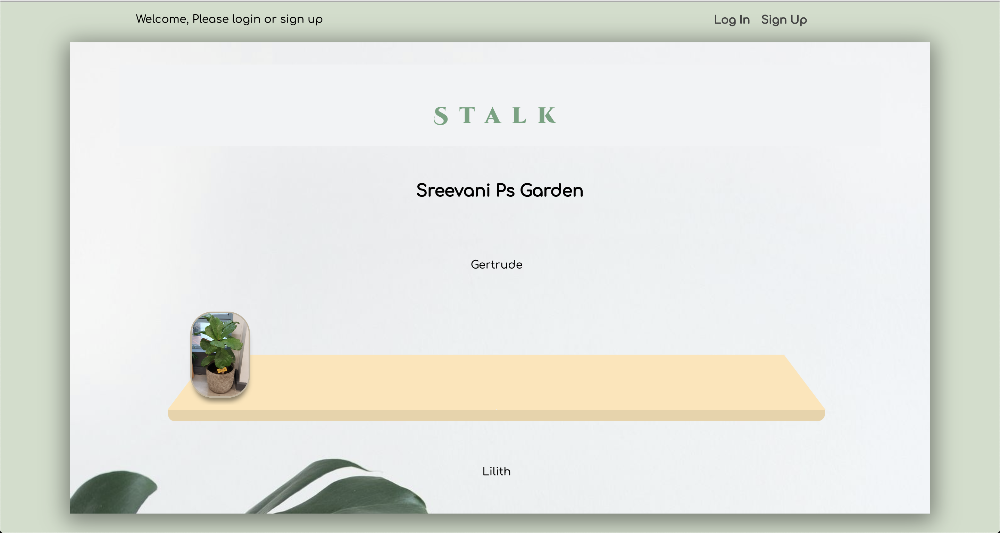
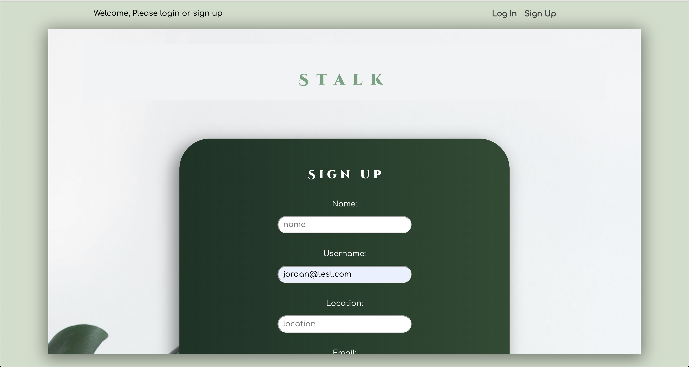

# Stalk - Plant Care Scheduler and Social Platform

## Purpose of the site

Provide a platform that helps you keep track of when you last watered your plants, schedule watering and provide notifications. You can also document the progress of your plants with photos in the my garden feature.

## Features

- Ruby on Rails API and React.js SPA interface
- My Garden, populated by photos of your plants to keep track of there progress
  - Home page displays latest photo of each plant in a users garden, grouped by user
  - Profile view displays individual plant and there progress
- Indicator on the time since each plant was last watered
  - Provides real-time updates to the second
  - Click to update when watered
- Calendar to schedule watering days
  - Set by the user so they can dynamically update the schedule based on season
- Notifications on login of which plants need watering that day
- Photo upload and storage provided by Cloudinary

## Link to Live Site

https://jaytees.github.io/frontend-stalk/#/

## Style

- Organic
- Clean
- Stylish

## Tech / Framework Used

- React
- react-notifications-component
- react-big-calendar
- moment
- Ruby
- Ruby on Rails
- JWT tokens
- Postgresql
- CSS
- Cloudinary
- Heroku

## Link to the Backend Repo

https://github.com/srv-dev/backend-stalk

## Experience & Process

- First team project, so dealing with the minefields of merge conflicts was a fun experience. But I loved the dynamic of group work.
- Really loved seeing our individual pieces of the project come together over the course the of the week. Everyone played a huge a part in the project and we were all really impressed and happy with what we achieved together.
- It has definitely left me with a sense of excitement about what can be achieved as part of a larger dev team.
- We first decided the MVP requirements of our app, wire-framed the UI with the help of some UX students and developed the SQL DB associations collaboratively.
- We then split the workflow into deliverables tracked using Trello.
- I first took responsibility for the user authentication on the back and front-end, challenging myself to build this without a library.
- We then pair-programmed some of the harder functionality, my team developed the rendering of real-time data for last watered.
- Once this was done I focused on the UI, styling and integrating the components and building interactivity.

## Wins

- **Full Stack Authentication** - Tackling this with no prior experience, was perhaps my biggest challenge and biggest reward. I choose to take on this task without the help of a library like Knock because I really wanted to know what was going on under the hood of such an important aspect of modern web apps. In the process I learnt a lot about;

  - The encoding and decoding of JWT tokens
  - How JWT tokens are used for authorisation
  - Functional programming in Ruby

- **Time Since Last Watered** - This was a real defining feature but also something we weren't really sure how to achieve. Which obviously made it even more satisfying. The biggest challenge was how to handle Ruby UNIX time format on the React.js front-end. After a bit of research the task began to look less daunting and we started developing the feature. But once we had worked out how to display the correct time we immediately had to convert it back to update the back-end. We can now display the time down the second though.

- **Styling** - I'm really proud of what I managed to achieve with the design aesthetic in just a few days. Most notably the garden display with the burger menu, pure css water drop and of course the pure CSS shelf. Also very happy with the form styling.

- **Hooks** - This was my first experience using and learning about hooks in functional components. They really made React feel a lot more intuitive for me and I haven't looked back.

## Challenges

- **Full Stack Authentication** - As mentioned above in Wins, the authentication process was testing. Having no prior knowledge it was a process of learning and understanding whilst implementing. I used a number of different online resources in the end, each providing different elements of the process (never the full picture), which I had to piece together to suit my needs and stack. A snippet of the backend code is previewed in the code section of the README.

- **Integrating Our Components** - As we approached the due date, we had to bring all of the components we had been individually working on together. This caused two problems; navigation and re-factoring. The re-factoring issue was the most challenging. My best example would be the times since last watered feature for each plant. In development this was built on a clone of the my garden component. Which seemed reasonable to avoid conflicting changes and distraction to other team members. So when I came to integrate, I had to take the code, extract the necessary parts into a new component, decide what data this component relied on from the parent, pass this down and refactor how it was handled in the component.

- **Version Control and Merge Conflicts** - These were difficult to overcome at first, with quite a few lost hours. After some research in the end we opted for branches, as each team member was a collaborator on the repo. This helped us gain an understanding of branches and once this was achieved it was (almost plain sailing).

## Code

- Authentication process

* Refactor of the handling of signup data. Using the useReducer hook and spread operators, to handle the change to multiple fields in the user object in one function.

- Couldn't not mention the shelf

## Screenshots

- Homepage

- Profile Page

- Your Personal Garden

- Other Users Gardens

- Signup form

## Things to do

- Finish the ability to follow other plants progress
- Navigation is quite difficult
- Email notifications
- Authorization for certain functions and components

## Known bugs

- Sometimes the calendar fails to show schedule for all plants in the upcoming months
- Need to hard refresh to update the time after clicking watered
